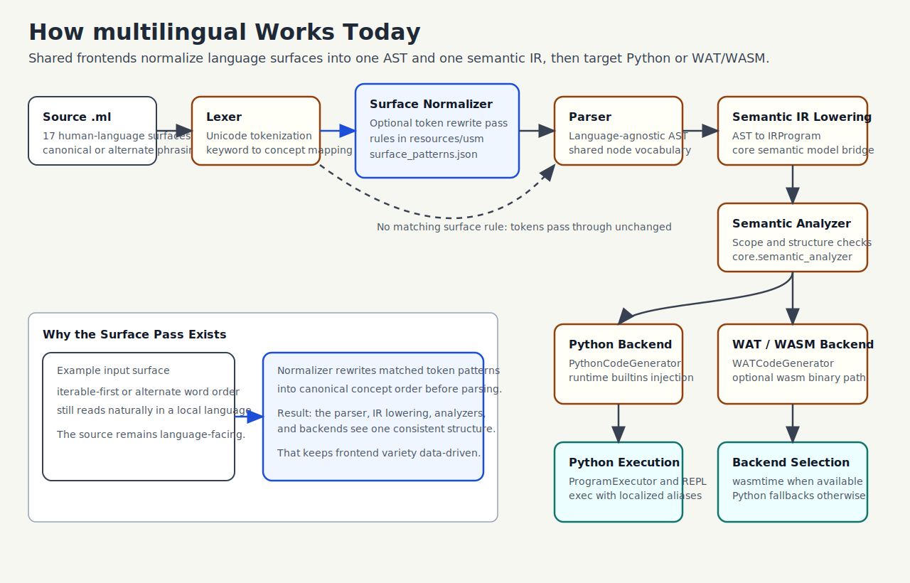

# multilingual
Not yet another programming language. A multilingual one.

> **One programming model. Many human languages.**  
> Write code in your language through multilingual frontends targeting one formal core.

## Motivation

- Problem: programming is still heavily bound to English-centric syntax and keywords.
- Idea: build multiple language frontends that compile into one typed core representation.
- Today: this is a small but working prototype; you can already write and run programs in English, French, Spanish, and other supported languages.

## Project Positioning

- This is not a beginner-only teaching DSL.
- This project targets a broad Python-like subset with localized language frontends.
- Goal: language-inclusive authoring without fragmenting runtime behavior.

## Who Is This For?

`multilingual` is for teachers, language enthusiasts, programming-language hobbyists, and people exploring LLM-assisted coding workflows across multiple human languages.

## Why Multilingual

- **Language-inclusive syntax**: Use localized keywords and built-in aliases (for example, `intervalle`, `rango`, `intervallo`).
- **Single execution pipeline**: Same flow for every language: lexer -> parser -> core lowering -> semantic checks -> Python codegen -> runtime.
- **Data-driven extensibility**: Add languages by updating registries/resources, not by rewriting parser/codegen logic.
- **REPL-first experience**: Start quickly, switch languages live, inspect keywords/operators from inside REPL.

### Pipeline Illustration



## What This Is / Is Not

- `Is`: a multilingual frontend family over one formal core.
- `Is`: a research/prototyping platform for localization-aware language tooling.
- `Is`: a forward-compilation model (`surface -> core -> execution`) with no round-trip guarantee.
- `Is not`: a claim that syntax translation alone solves all onboarding barriers.
- `Is not`: full natural-language understanding.
- `Is not`: a replacement for English-heavy ecosystem docs, examples, and tooling (yet).

## Current Limitations

- Localized keywords can still feel unnatural in some languages because grammar/word order is mostly shared.
- A small declarative surface-normalization layer now supports selected alternate phrasing patterns, but coverage is still limited.
- The project supports a controlled subset (CNL-style) per language, not unconstrained natural language.
- Standard library/module APIs mostly stay canonical Python names; localization is focused on keywords and selected builtins.
- Full drop-in compatibility with arbitrary existing Python code is not claimed yet.

Details:
- Word order and naturalness: [docs/word_order_and_naturalness.md](docs/word_order_and_naturalness.md)
- Stdlib localization boundaries: [docs/stdlib_localization.md](docs/stdlib_localization.md)
- Controlled language scope: [docs/cnl_scope.md](docs/cnl_scope.md)
- Python compatibility matrix: [docs/compatibility_matrix.md](docs/compatibility_matrix.md)
- Python 3.12 compatibility roadmap: [docs/compatibility_roadmap.md](docs/compatibility_roadmap.md)

## Quick Start

Source files for this language use the `.ml` extension (for example: `hello.ml`).
Requires Python 3.12 or newer.

### 1. Install

```bash
pip install -r requirements.txt
# or
pip install .
```

### 2. Hello World In Multiple Languages

```text
# English
print("Hello world")

# French
afficher("Bonjour le monde")

# Spanish (another language example)
imprimir("Hola mundo")

# Japanese
表示("こんにちは世界")

```

### 3. Use the REPL (interactive mode)

Start REPL:

```bash
# 1) Default mode (English keywords)
multilingual repl

# 2) French mode
multilingual repl --lang fr

# Optional: show generated Python while executing
multilingual repl --show-python
```

Inside the REPL, type code and press Enter to execute.

Default mode example (English):

```text
>>> let total = 0
>>> for i in range(4):
...     total = total + i
...
>>> print(total)
6
```

French mode example:

```text
>>> soit somme = 0
>>> pour i dans intervalle(4):
...     somme = somme + i
...
>>> afficher(somme)
6
```

French phrase aliases are also supported:

```text
si x:
    afficher("ok")
sinon si y:
    afficher("fallback")

pour chaque i dans intervalle(3):
    afficher(i)
```

REPL commands:

- `:help` show commands
- `:language <code>` switch language
- `:python` toggle generated Python display
- `:reset` clear session state
- `:kw [XX]` show language keywords
- `:ops [XX]` show operators and symbols
- `:q` exit

Note: selected universal built-ins (for example `range`, `len`, `sum`) support localized aliases while keeping the universal names available.

### 4. Execute and inspect programs

Execution/transpilation examples and AST parsing examples are in [USAGE.md](USAGE.md).

### 5. Run A `.ml` Source File

Create a file, for example `hello.ml`:

```text
print("Hello world")
```

Run it:

```bash
multilingual run hello.ml
```

Optional (force language instead of auto-detect):

```bash
multilingual run hello.ml --lang fr
```

### 6. Cross-Language Module Imports

You can import `.ml` modules across languages in one program. Example:

`module_fr.ml`:

```text
soit valeur = 41
def incremente(x):
    retour x + 1
```

`main_en.ml`:

```text
import module_fr
print(module_fr.incremente(module_fr.valeur))
```

Run:

```bash
multilingual run main_en.ml --lang en
```

## Roadmap (Short)

- v0 (today): toy-but-working interpreter/transpiler, multiple languages, core constructs, REPL, and a tested end-to-end pipeline.
- next: better tooling, IDE support, more languages, stronger frontend equivalence tests, and potential LLM-assisted code translation workflows.

## What You Can Use

- Numerals across scripts: `MPNumeral`, `UnicodeNumeral`, `RomanNumeral`
- Extended numerals: `ComplexNumeral`, `FractionNumeral`, `NumeralConverter`
- Keyword model: `KeywordRegistry`, `KeywordValidator`
- Date/time: `MPDate`, `MPTime`, `MPDatetime`
- Frontend: `Lexer`, `Parser`, AST nodes, `SemanticAnalyzer`
- Runtime: `PythonCodeGenerator`, `RuntimeBuiltins`, `ProgramExecutor`, `REPL`

Additional syntax now supported:

- Type annotations (`x: int`, `def f(x: int) -> str`)
- Nested comprehension clauses (`[x for row in rows for x in row]`)
- Set literals (`{1, 2, 3}`)
- Multiple context managers (`with A() as a, B() as b`)
- Dictionary unpacking (`{**d1, **d2}`)
- Hex/oct/bin literals (`0xFF`, `0o77`, `0b101`)
- Scientific notation (`1.5e-3`)
- Async features (`async def`, `await`, `async for`, `async with`)
- Walrus operator (`:=`)

Supported pilot languages: English, French, Spanish, German, Italian, Portuguese, Polish, Dutch, Swedish, Danish, Finnish, Hindi, Arabic, Bengali, Tamil, Chinese (Simplified), Japanese.

## Run Examples

See [examples/README.md](examples/README.md) for narrative `.ml` examples
(English/French equivalents) and runnable commands.

### Japanese Surface Syntax Example

These two files compute the same result (`15`) using canonical and alternate
surface loop phrasing:

- Surface form: `examples/surface_for_ja.ml`
- Canonical form: `examples/surface_for_ja_canonical.ml`

Run:

```bash
multilingual run examples/surface_for_ja.ml --lang ja
multilingual run examples/surface_for_ja_canonical.ml --lang ja
```

### Spanish And Portuguese Surface Syntax Examples

These pairs compute the same result using canonical and iterable-first loop phrasing:

- Spanish surface: `examples/surface_for_es.ml`
- Spanish canonical: `examples/surface_for_es_canonical.ml`
- Portuguese surface: `examples/surface_for_pt.ml`
- Portuguese canonical: `examples/surface_for_pt_canonical.ml`

Run:

```bash
multilingual run examples/surface_for_es.ml --lang es
multilingual run examples/surface_for_es_canonical.ml --lang es
multilingual run examples/surface_for_pt.ml --lang pt
multilingual run examples/surface_for_pt_canonical.ml --lang pt
```

### Semantic Equivalence (English vs French)

These two snippets are semantically equivalent:

English (`examples/arithmetics_en.ml`):

```text
let a = 10
let b = 3
print("a + b =", a + b)
```

French (`examples/arithmetics_fr.ml`):

```text
soit a = 10
soit b = 3
afficher("a + b =", a + b)
```

## Documentation

Use this README for setup and workflow; use `docs/` for design rationale and policy details.

- Usage guide: [USAGE.md](USAGE.md)
- Examples guide: [examples/README.md](examples/README.md)
- Detailed reference: [docs/reference.md](docs/reference.md)
- Design overview: [docs/design.md](docs/design.md)
- Related work and differentiation: [docs/related_work.md](docs/related_work.md)
- Core formalization: [docs/core_spec.md](docs/core_spec.md)
- Frontend translation contracts: [docs/frontend_contracts.md](docs/frontend_contracts.md)
- Evaluation plan: [docs/evaluation_plan.md](docs/evaluation_plan.md)
- Word order and syntax naturalness notes: [docs/word_order_and_naturalness.md](docs/word_order_and_naturalness.md)
- Standard library localization strategy: [docs/stdlib_localization.md](docs/stdlib_localization.md)
- Controlled language scope and ambiguity policy: [docs/cnl_scope.md](docs/cnl_scope.md)
- Python compatibility matrix: [docs/compatibility_matrix.md](docs/compatibility_matrix.md)
- Python 3.12 compatibility roadmap: [docs/compatibility_roadmap.md](docs/compatibility_roadmap.md)
- Translation governance guide: [docs/translation_guidelines.md](docs/translation_guidelines.md)
- Development and debugging guide: [docs/development.md](docs/development.md)
- Guide complet en francais: [docs/fr/programmation.md](docs/fr/programmation.md)
- Language onboarding guide: [docs/language_onboarding.md](docs/language_onboarding.md)
- Contribution guide: [CONTRIBUTING.md](CONTRIBUTING.md)
- Release process: [docs/releasing.md](docs/releasing.md)
- Changelog: [CHANGELOG.md](CHANGELOG.md)

## Development

```bash
python -m pytest -q
python -m pylint $(git ls-files '*.py')
```

## License

- Code: GPLv3+
- Documentation/content: CC BY-SA 4.0
